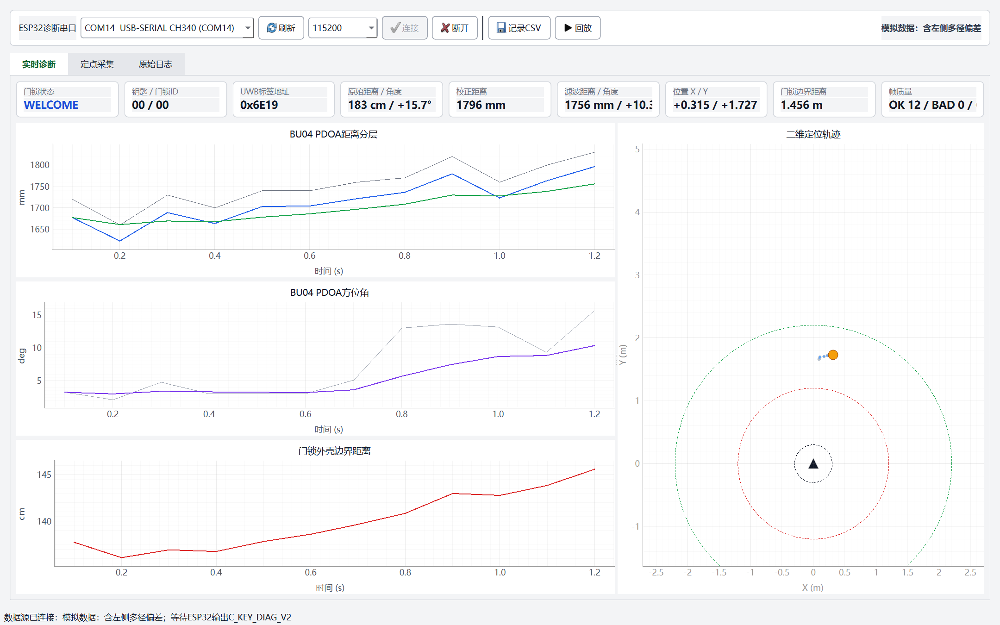
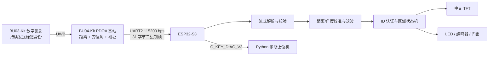

# 基于 UWB 的数字钥匙实验系统

> 全国大学生电子设计竞赛 C 题原型：使用 BU03-Kit 标签、BU04-Kit PDOA 基站和
> ESP32-S3，实现身份认证、距离/方位测量、区域判定、自动开闭锁与可视化诊断。

[](https://github.com/espressif/esp-idf)
[](host/README.md)
[](https://github.com/qll070226-a11y/c-key-system-bu03/actions/workflows/ci.yml)
[](docs/CONTEST_ACCEPTANCE_STATUS.md)



## 项目概览

本项目围绕“数字钥匙靠近门锁”的完整业务闭环展开。钥匙端持续通过 UWB 发送身份
ID，门锁端在同一条无线链路中获取标签地址、径向距离和方位角；ESP32-S3 对原始
测量值进行校准和抗抖处理，再驱动中文 TFT、LED、低电平蜂鸣器及门锁状态。

与只展示一组测距数字的演示不同，本系统把通信、解析、滤波、认证、状态机、失效
保护和测试工具做成了一条可验证的数据链。



## 核心成果

| 能力 | 实现方式 |
|---|---|
| 无线身份认证 | BU03 标签短地址映射为 4 位逻辑钥匙 ID，与门锁拨码 ID 实时比对 |
| 距离与方位定位 | BU04 PDOA 单基站同步输出距离、角度和标签地址 |
| 稳健数据处理 | 帧校验与流式重同步；距离中值 + EMA；角度 Hampel + One Euro |
| 区域业务逻辑 | 感应区、迎宾区、开锁区分层判断，带 5 cm 回差和连续帧确认 |
| 失效保护 | 数据超时、非法 ID、坏帧或钥匙离线时立即闭锁，上电默认不误开 |
| 人机交互 | 中文 TFT 显示身份、认证、距离、方位和门锁状态，LED/蜂鸣器同步提示 |
| 工程验证 | 纯 C 单元测试、Python 测试、串口采集、CSV 回放及自动验收报告 |

## 实测记录

以下结果来自仓库内保留的实机报告和串口记录，不是仿真数据。

| 场景 | 实测结果 | 证据 |
|---|---|---|
| 3.00 m 持续身份通信 | 15.010 s 内 718 帧，47.83 Hz，最大帧间隔 0.151 s，解析错误 0 | [第 1 项验收报告](reports/requirement_1_20260801_012554.md) |
| 正前方约 1 m 定位 | 10 s 内 495 帧，校正距离约 1.01 m，方位角约 +1.85° | [比赛验收状态](docs/CONTEST_ACCEPTANCE_STATUS.md) |
| 标签断电保护 | UWB 数据停止后，系统在 500 ms 超时窗口后进入无钥匙闭锁状态 | [完赛版本说明](docs/FINAL_V2_RELEASE.md) |
| 角度抗抖对比 | 同组静态数据中，角度标准差由 0.593° 降至 0.414° | [标定与验收](docs/CALIBRATION_AND_ACCEPTANCE.md) |

完整评分项仍按“软件通过”和“实机通过”分别记录，尚未形成统一报告的测点不会标成
完成，详见[比赛验收状态](docs/CONTEST_ACCEPTANCE_STATUS.md)。

## 关键设计

### 1. 可靠的串口流解析

BU04 输出固定 31 字节二进制帧。解析器不假设每次串口读取恰好得到一整帧，而是在
字节流中寻找帧头、检查长度与校验和，并在丢字节或噪声后重新同步。这样可处理粘包、
拆包和坏帧，避免一次通信异常持续污染后续定位。

### 2. 面向动态判决的滤波

- 距离：5 点中值滤波抑制离群点，再以 `alpha = 0.35` 的 EMA 平滑随机波动；
- 角度：7 点环形 Hampel 剔除突变，再用 One Euro 在静态稳定性和动态响应间折中；
- 校准：保留零偏与分段修正，当前完赛版针对负角系统误差做了分段补偿；
- 判决：滤波值只负责估计，状态机额外使用回差和 4 帧确认防止边界反复跳变。

### 3. 安全优先的状态机

区域距离以门锁圆柱外壳为零点，即 `UWB 天线中心距离 - 0.30 m`。开锁、迎宾阈值
分别采用 `0.95/1.05 m` 与 `1.95/2.05 m` 的进出回差。任何数据超时、身份失配或
定位无效都会覆盖普通区域逻辑并闭锁。

更多细节见[系统架构与设计取舍](docs/ARCHITECTURE.md)。

## 硬件组成与接线

| 模块 | 作用 | 关键连接 |
|---|---|---|
| BU03-Kit | 数字钥匙标签 | 独立电池供电，UWB 持续发送 |
| BU04-Kit | PDOA 门锁基站 | `UART2_TX -> ESP32 GPIO18`，共地，独立 5 V DCDC |
| ESP32-S3-N16R8 | 主控制器 | 解析、滤波、认证、状态机和诊断输出 |
| 2.4 英寸 SPI TFT | 中文状态界面 | **只允许 3.3 V 供电** |
| 4 位拨码开关 | 设置门锁认可 ID | GPIO 输入并做软件消抖 |
| LED / 低电平蜂鸣器 | 区域与门锁提示 | 由扩展板和洞洞板连接 |

完整 GPIO、电源分配和射频安装注意事项见[硬件与接线](docs/HARDWARE.md)。

## 快速开始

### 固件

环境要求：Windows、ESP-IDF 5.5.x、已进入 ESP-IDF PowerShell。

```powershell
# 运行与硬件无关的 C 核心测试
.\tests\run_host_tests.bat

# 构建 ESP32-S3 固件
.\build_idf.bat

# 将 COMxx 替换为 ESP32 的实际端口
.\flash_idf.bat COMxx
```

不要把 BU04 的 USB 数据口当作 ESP32 烧录口。端口号会随电脑和插拔顺序变化。

### 诊断上位机

```powershell
cd host
.\setup.bat
.\run.bat
```

上位机连接 ESP32 诊断串口，支持实时曲线、二维轨迹、原始/滤波数据对照、定点采集、
CSV 记录与回放。详细使用方法见[上位机说明](host/README.md)。

### 自动验收

```powershell
py -3 tools\verify_static_position.py --help
py -3 tools\verify_requirement_1.py --help
```

工具可从串口或日志读取 `C_KEY_DIAG_V3`，按距离、角度、帧率和身份条件自动生成
Markdown/JSON 报告。推荐测点和操作顺序见[标定与验收](docs/CALIBRATION_AND_ACCEPTANCE.md)。

## 仓库结构

```text
components/           ESP-IDF 组件：核心算法、I/O、TFT、UWB 接口
main/                 固件入口与任务编排
host/                 Python/Qt 诊断上位机及其测试
tests/                可在 PC 上运行的纯 C 单元与场景测试
tools/                配置备份、串口采集、标定和自动验收工具
docs/                 架构、协议、硬件、标定与交接文档
reports/              已完成的实机验收报告
backups/              BU03/BU04 AT 配置快照
```

## 文档导航

- [系统架构与设计取舍](docs/ARCHITECTURE.md)
- [硬件与接线](docs/HARDWARE.md)
- [BU04 PDOA 帧协议](docs/BU04_PDOA_PROTOCOL.md)
- [标定与验收](docs/CALIBRATION_AND_ACCEPTANCE.md)
- [比赛评分项状态](docs/CONTEST_ACCEPTANCE_STATUS.md)
- [完赛 2 版参数](docs/FINAL_V2_RELEASE.md)
- [开发交接](HANDOFF.md)

## 版本说明

当前完整方案已合入 `main`，开发过程保留在 `pdoa-one-euro`；冻结版本为
`final-v2-20260801`，校准前版本为 `final-v1-20260801`。旧的双 BU03 TWR
方案保留在 `twr-direct-range-20260731`，便于对照和回退。

本仓库是竞赛实验原型，重点验证 UWB 定位与数字钥匙业务闭环，并非量产车载安全
产品。当前身份机制是标签地址到逻辑 ID 的映射，不包含量产数字钥匙所需的安全芯片、
双向挑战应答、密钥轮换和抗中继攻击设计。
